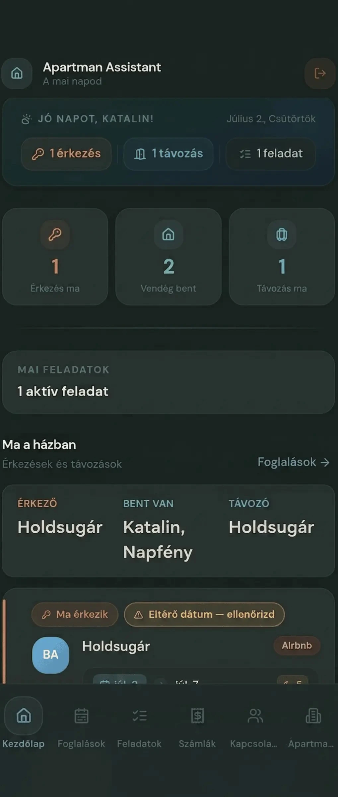

# Apartman Assistant — Landing Page

Statikus, moduláris landing page. Nincs build lépés, nincs keretrendszer —
egyszerű HTML/CSS/JS, GitHub webes szerkesztővel is karbantartható.

## Fájlszerkezet

```
index.html      → az oldal teljes tartalma, blokkokra bontva
style.css       → minden stílus, blokkonként kommentezve
script.js       → cookie consent, scroll animáció, CTA követés
robots.txt      → keresőmotor-szabályok
sitemap.xml     → oldaltérkép
assets/         → ide kerülnek majd a screenshotok és képek (lásd lent)
```

## Hogyan van felépítve az index.html

Minden szekció önálló, `<!-- BLOKK: ... -->` kommenttel jelölve, és
`data-block="..."` attribútummal ellátva:

- `header` — fejléc, logó, "Ingyenes próba" gomb
- `hero` — nyitó szekció
- `problem` — "Talán neked is ismerős" blokk
- `feature-guest-arrival` — Megérkezik a vendég
- `feature-cleaning` — Távozik a vendég / takarítás
- `highlight` — kiemelt sáv (digitális asszisztens)
- `feature-new-booking` — Új foglalás / iCal import
- `feature-auto-tasks` — Automatikus feladatok
- `feature-payments` — Fizetések
- `feature-contacts` — Kapcsolatok
- `feature-onboarding` — Első lépések / iCal beállítás
- `feature-grid` — további funkciók rácsban
- `story` — miért készült el
- `faq` — GYIK
- `final-cta` — záró CTA
- `footer` — lábléc
- `cookie-banner` — GDPR cookie sáv

**Átrendezés:** mivel minden blokk önálló `<section>`, kivágható és
máshova beilleszthető a fájlon belül — nincs köztük rejtett függőség
(a sorrendtől független működésre lett tervezve).

**Bővítés:** egy új funkció-blokk hozzáadásához másolj egy meglévő
`feature-*` szekciót (pl. `feature-payments`), és írd át a szöveget,
ikont és screenshot-hivatkozást.

## Valódi screenshotok behelyettesítése

Az oldalon **8 db** telefon-mockup helytartó van, ebben a sorrendben:

| # | Blokk | Ajánlott fájlnév | Mit mutasson |
|---|---|---|---|
| 1 | hero | `assets/screenshots/01-hero-dashboard.webp` | Kezdőképernyő / mai teendők |
| 2 | feature-guest-arrival | `assets/screenshots/02-guest-profile.webp` | Vendég adatlap |
| 3 | feature-cleaning | `assets/screenshots/03-cleaning-status.webp` | Takarítás állapotjelző |
| 4 | feature-new-booking | `assets/screenshots/04-new-booking.webp` | Foglalási lista / naptár |
| 5 | feature-auto-tasks | `assets/screenshots/05-auto-tasks.webp` | Napi feladatok |
| 6 | feature-payments | `assets/screenshots/06-payments.webp` | Fizetési állapot / számlák |
| 7 | feature-contacts | `assets/screenshots/07-contacts.webp` | Kapcsolatok lista |
| 8 | feature-onboarding | `assets/screenshots/08-ical-setup.webp` | iCal beállítási útmutató |

**Csere lépései egy adott helyen:**

1. Töltsd fel a képet ide: `assets/screenshots/<fájlnév>`
   (ajánlott méret: 1080×2340 px, `.webp` formátum a gyors betöltésért).
2. Az `index.html`-ben keresd meg az adott blokk `.device-frame__placeholder`
   `<div>`-jét, és **töröld ki**.
3. A közvetlenül alatta lévő, kikommentezett ``
   sort **vedd ki a kommentből** (távolítsd el a `<!-- Csere:` elejét és a
   ` -->` végét).

Példa — mielőtt:
```html
<div class="device-frame__placeholder">
  <svg class="icon"><use href="#icon-image"/></svg>
  <span class="device-frame__placeholder-label">Képernyőkép helye</span>
  <span class="device-frame__placeholder-meta">Dashboard / mai teendők · 1080×2340</span>
</div>
<!-- Csere:  -->
```

Példa — utána:
```html

```

A `.device-frame` (telefonkeret) automatikusan méretre vágja és lekerekíti
a képet (`object-fit: cover`), tehát nem kell pixelpontosan a keret
arányára szabnod a screenshotot.

## SEO — mit kell még kitölteni

- **Domain:** ✅ végleges — `apartmanassistant.hu` a megerősített, éles domain,
  ez szerepel a `<link rel="canonical">`, az Open Graph és a
  `sitemap.xml`/`robots.txt` fájlokban is. Nincs teendő.
- **OG kép:** `assets/og-image.jpg`, ajánlott méret 1200×630 px — ez
  jelenik meg, ha valaki megosztja a linket Facebookon/Messengeren/LinkedInen.
  Ez még nincs feltöltve, ezt pótolni kell.
- **Favicon:** ✅ elkészült — `favicon.png`, `assets/favicon-32.png` és
  `assets/apple-touch-icon.png` a valódi Apartman Assistant ikonból generálva.
- A `sitemap.xml`-ben a `<lastmod>` dátumot érdemes frissíteni, ha
  tartalmi változás történik az oldalon.

## Analytics (GA4 / Meta Pixel)

A `script.js` tetején egy **TODO** blokk vár a tényleges azonosítókra
(`GA4_MEASUREMENT_ID`, `META_PIXEL_ID`). A mérőkódok **csak akkor**
töltődnek be, ha a látogató elfogadja a cookie-kat — ez a GDPR
"Consent Mode v2" logikáját követi, tehát nem kell külön cookie-banner
megoldást keresned hozzá.

## Teljesítmény

- A betűtípusok (`Outfit`, `Inter`) Google Fonts CDN-ről töltődnek,
  `preconnect`-tel felgyorsítva.
- Az ikonok egyetlen rejtett SVG-sprite-ban vannak (nincs külön
  ikon-fájlokért induló hálózati kérés).
- A screenshotok `loading="lazy"` attribútummal töltődnek be (a hero
  kép kivétel, az `loading="eager"`, mert az első látható tartalom része).
- Ha a képeket becsatolod, érdemes `.webp` formátumban feltölteni —
  ez jelentősen kisebb fájlméretet ad, mint a `.png`/`.jpg`.

## Helyi megtekintés

Nincs build lépés. Elég megnyitni az `index.html`-t bármelyik
böngészőben, vagy egy egyszerű helyi szerverrel:

```bash
python3 -m http.server 8000
```

majd `http://localhost:8000` a böngészőben.

## Amit érdemes tudni az első verzióról

Ez egy **stabil alapváz** — a cél nem a végleges dizájn, hanem egy jól
strukturált, könnyen bővíthető kiindulópont volt. A tartalom szó szerint
a megadott szövegből épült be; a vizuális finomítás (színárnyalatok,
spacing, esetleg egyedi illusztrációk) egy következő körben könnyen
tovább alakítható blokkonként, mivel minden blokk önálló és jól
elhatárolt.
